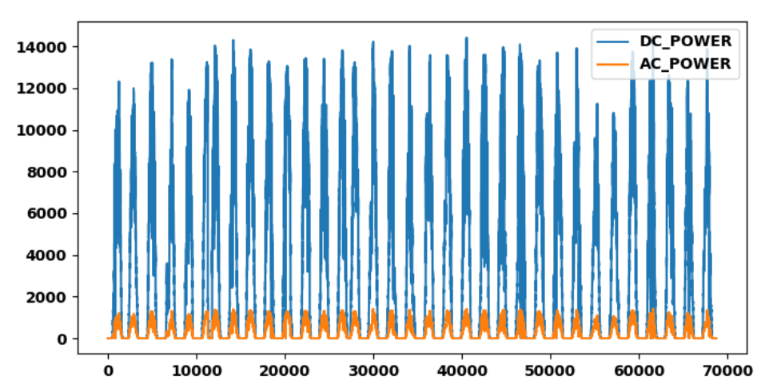
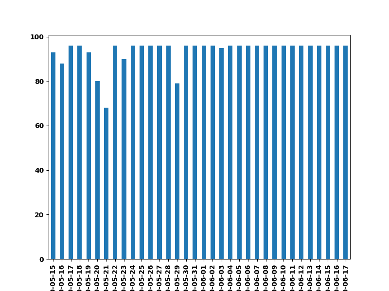
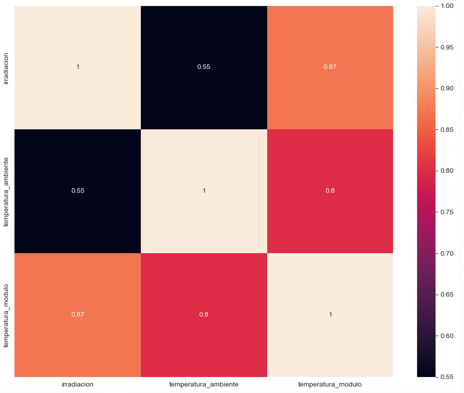
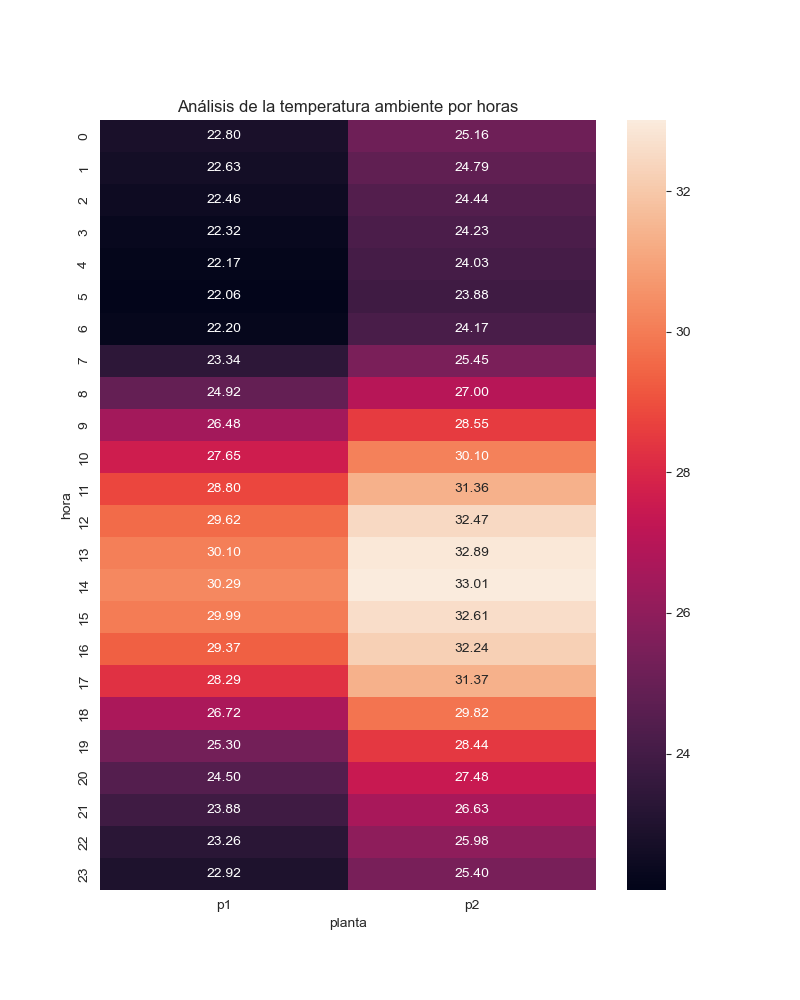
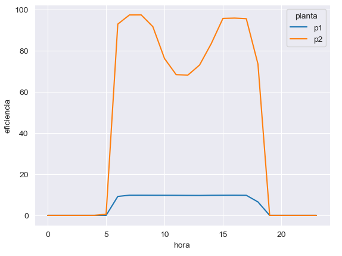
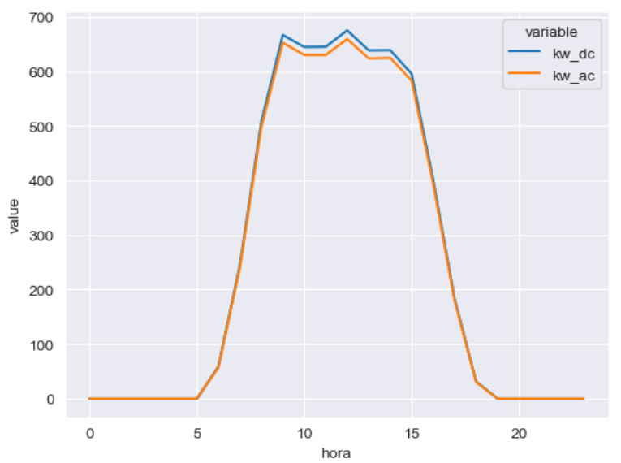

# Analisis-Plantas-Energia-Solar

En este proyecto se analizarán los datos de una compañía de generación de energía solar fotovoltaica. Se han detectado comportamientos anómalos en dos de las plantas; El objetivo es tratar de identificar el motivo y resolver los problemas observados.

## Objetivo

Analizar los datos de las plantas solares para identificar problemas que afectan su rendimiento.

Antes de empezar con el análsis se comienza por entender el proceso y cómo funcionan este tipo de plantas.

## Entidades y Datos

Para determinar las entidades es necesario conocer de qué se compone una planta solar.

- **Celdas**: Unidad mínima de generación.
- **Módulos**: Celdas encapsuladas en estructuras rectangulares.
- **Paneles**: Compuestos por varios módulos.
- **Arrays**: Filas de paneles.
- **Inverters**: Transforman DC en AC.
- **Planta**: Conjunto de inverters, medidores y sensores.

## KPIs

- **Irradiación**: Energía solar que llega a los paneles.
- **Temperatura Ambiente y del Módulo**: Medida en grados Centigrados.
- **Potencia DC**: Corriente continua medida en kW.
- **Potencia AC**: Corriente alterna medida en kW.
- **Eficiencia del Inverter**: Calculada como \( \text{Eficiencia} = \left(\frac{\text{AC}}{\text{DC}}\right) \times 100 \% \)

## Palancas Clave

1. **Irradiación**: Influye en la generación de corriente continua (DC). Un exceso de temperatura puede reducir la eficiencia.
2. **Estado de los Paneles**: Paneles limpios y funcionando correctamente son claves para maximizar la generación de DC.
3. **Eficiencia de Inverters**: La conversión de DC a corriente alterna (AC) debe ser eficiente para minimizar pérdidas.
4. **Medidores y Sensores**: Esenciales para monitorizar y detectar fallos. Su mal funcionamiento puede comprometer el análisis.

## Granularidad de los Datos

Los datos se registran en ventanas de 15 minutos durante un período de 34 días. Las entidades disponibles son:

- **Plantas**: 2 plantas.
- **Inverters**: Varios inverters por planta.
- **Sensores**:
  - **Irradiación**: 1 sensor por planta.
  - **Temperatura Ambiente**: 1 sensor por planta.
  - **Temperatura del Módulo**: 1 sensor por planta.

# Análisis de Generación y Transformación de Energía en Plantas Solares

## Datos de Generación de la Planta 1

Se observó una discrepancia significativa entre la generación de corriente continua (DC) y corriente alterna (AC) en la Planta 1. La conversión de DC a AC es sorprendentemente baja, con los inverters transformando solo aproximadamente el 10% de DC a AC.

### Detalles de los Inverters

- **Número de Inverters**: 22
- **Mediciones**: Todos los inverters tienen un número similar de mediciones, aunque no idéntico.
  - Las diferencias podrían deberse a paradas por mantenimiento o pérdidas de datos, lo cual debería considerado en el análisis.

### Período de Datos

- **Fechas**: 15 de mayo de 2020 a 17 de junio de 2020
- **Cobertura**: Datos disponibles para todos los días del período.
  - **Días con Menos Mediciones**: Algunos días, como el 21/05 y el 29/05, tienen menos mediciones, indicando que los datos no son completamente regulares.

### Datos del Sensor Ambiental Planta 1

- **Fechas**: 15 de mayo de 2020 a 17 de junio de 2020
- **Cobertura**: Datos disponibles para todos los días del período.
  - **Días con Menos Mediciones**: Algunos días, como el 21/05 y el 29/05, también presentan menos mediciones, lo cual refleja una irregularidad en la recopilación de datos.

  
  
## Datos de Generación de la Planta 2

En la Planta 2, los valores de corriente continua (DC) y corriente alterna (AC) están mucho más cercanos entre sí. Vamos a calcular el ratio de conversión DC a AC para evaluar su rendimiento.

Ahora los valores del ratio son muy cercanos a uno.
De media el ratio de DC es aproximadement un 2% superior a AC. Hay algunos casos donde AC es mayor que DC, esto a priori es raro, puede tener su explicaicon técnica.

### Detalles de los Inverters

- **Número de Inverters**: 22
- **Mediciones**: La mayoría de los inverters tienen un número similar de mediciones, aunque hay 4 inverters que tienen unas 800 mediciones menos.
  - Las diferencias en el número de mediciones deben ser consideradas en la fase de análisis.

### Período de Datos

- **Fechas**: 15 de mayo de 2020 a 17 de junio de 2020
- **Cobertura**: Datos disponibles para todos los días del período.
  - **Días con Menos Mediciones**: Algunos días, como el 20/05 y otros días, tienen menos mediciones, lo que sugiere una falta de regularidad en los datos.

### Calidad de Datos - Sensor Ambiental

- **Fechas**: 15 de mayo de 2020 a 17 de junio de 2020
- **Cobertura**: Datos disponibles para todos los días del período.
  - **Días con Menos Mediciones**: Algunos días, como el 15/05, presentan menos mediciones, aunque la falta de datos es menor en comparación con otros datasets. No obstante, la recopilación de datos no es completamente regular.

## Principales Conclusiones Hasta este punto

### Eficiencia de los Inverters

- **Planta 1**: Los inverters parecen estar transformando solo el 10% de la corriente continua (DC) a corriente alterna (AC), lo que es muy bajo.
- **Planta 2**: El ratio de conversión está mucho más cerca del 100%, lo que indica una conversión eficiente de DC a AC.

### Cálculo de la Eficiencia del Inverter

Para evaluar la eficiencia de los inverters, se crea la variable eficiencia de la siguiente forma: (AC/DC) * 100.

#### Distribución de la Eficiencia

 

- **Distribución Bimodal**: Hay dos grupos claramente diferenciados:
  - **Planta 1**: Valores cercanos al 0%.
  - **Planta 2**: Valores de AC muy similares a los valores de DC, con una eficiencia en torno al 90%.

## Análisis e Insights

### Análisis de la Recepción de Energía Solar

La primera variable de análisis es la recepción de energía solar. Para esto, se utilizan los siguientes KPIs:
- **Irradiación**: Energía solar que llega a los paneles.
- **Temperatura Ambiente**: Medida en grados Celsius.
- **Temperatura del Módulo**: Medida en grados Celsius.

Cada planta cuenta con un único sensor para cada KPI, por lo que los datos son los mismos para todos los inverters dentro de una planta. Es importante entender cómo interactúan estas variables antes de analizar su impacto en el rendimiento de los inverters.

#### Diferencia en la Energía Recibida por Planta

En general, la **Planta 2** recibe más energía solar que la **Planta 1**. Sin embargo, esta diferencia en la recepción de energía solar no parece explicar completamente el problema de rendimiento observado.

#### Relación entre Irradiación, Temperatura Ambiente y Temperatura del Módulo

- La **irradiación** muestra una alta correlación con la **temperatura del módulo**, cercana a 1, lo que indica que la temperatura del módulo aumenta con la irradiación.
- La **irradiación** correlaciona menos con la **temperatura ambiente**, aunque sigue siendo una correlación significativa. Esta menor correlación puede deberse a que la temperatura ambiente al inicio del día es más baja después de la noche y se incrementa a medida que avanza el día.

#### Análisis de la Irradiación media por hora

- La **mayor irradiación** se produce entre las 11:00 y las 13:00.
- La **irradiación** cesa después de las 18:00.

#### Análisis de la Temperatura Media por Horas

- Ambas plantas muestran patrones similares en términos de temperatura, lo que sugiere que están ubicadas en zonas geográficas no muy distantes entre sí.
- La **irradiación** está presente entre las 07:00 y las 17:00, y la **irradiación máxima** ocurre entre las 11:00 y las 12:00.
- La **temperatura ambiente máxima** se produce entre las 14:00 y las 16:00.

Se observa un **retraso** (lag) entre la irradiación y la temperatura: la máxima irradiación ocurre a las 12:00, mientras que la temperatura ambiente alcanza su máximo entre las 14:00 y las 16:00.

### Análisis de la Irradiación frente a la Energía Corriente (DC) Generada

- **Planta 2** produce significativamente menos kW de DC en comparación con la **Planta 1**, a pesar de niveles similares de irradiación.
- Anteriormente, se observó que la relación entre DC y AC en la Planta 1 era anómala.
- Asumiremos que los datos de DC y AC son correctos para continuar el análisis.

### ¿Es Constante la Generación de Energía a lo Largo del Día?

- **Planta 1** muestra una mayor variabilidad en la generación de DC, mientras que la **Planta 2** es mucho más constante.
- Los bajos niveles de generación de DC en la Planta 2 son sorprendentes en comparación con la Planta 1.

#### Análisis Diario de la Generación

- **Planta 1**:
  - Los patrones de generación son consistentes en general.
  - Se observan excepciones: una caída el 19 de mayo, una pausa el 20 de mayo, y otra caída el 5 de junio.
  - Ninguna de estas anomalías parece ser estructural; los patrones intradía son similares y correctos en general.
  - Se recomienda investigar específicamente estos días para entender las causas.

- **Planta 2**:
  - El día 20 de mayo muestra un comportamiento anómalo.
  - Los niveles de producción son constantes a lo largo de los días, pero aproximadamente diez veces inferiores a los de la Planta 1.

### Insight

- Los niveles bajos de DC en la Planta 2 son constantes y sus curvas diarias parecen normales.

### Insights analisis irradiación y generación de DC

- **Irradiación y Energía Solar**: Ambas plantas reciben una cantidad suficiente y similar de energía solar, por lo que, en teoría, deberían tener un rendimiento similar.
- **Generación de DC**:
  - **Planta 1**: Generación de DC es alta y estable, con pequeñas variaciones puntuales.
  - **Planta 2**: Generación de DC es mucho menor pero constante.

- **Conclusión**: Asumiendo que los datos son correctos, parece haber un problema estructural en la generación de DC de la Planta 2.

### Análisis de la Transformación de Energía DC en AC

- **Patrones Claros**: La Planta 2 transforma la corriente DC a AC de manera mucho más eficiente que la Planta 1.

#### Insight

- La Planta 1 muestra una capacidad de transformación de DC a AC muy baja, lo que sugiere problemas con los inverters.

#### Otras Conclusiones

1. **Planta 1**: 
   - Revisar en detalle los inverters para identificar si todos están afectados o si algunos están sesgando la media de eficiencia.
   
2. **Planta 2**:
   - Investigar por qué la eficiencia de conversión disminuye durante las horas de mayor irradiación.

### Análisis Adicional de la Planta 2

- **Pérdida de Eficiencia**:
  - En las horas centrales del día, se observa pérdida de eficiencia en la Planta 2.
  - Si hacemos el mismo análisis solo sobre la planta 2, la pérdida energía en las horas centrales del día existe pero es mucho menor. 
  
- **Distribución de Eficiencia**:
  - La eficiencia de conversión es cero en un conjunto de datos, lo que contribuye al problema observado.
  - Si ponemos la condición de que la generacion de DC es mayor que 0, la eficiencia de conversion supera el 96&, por lo que el problema parece estar relacionado con la falta de generación de DC en esos momentos, no con un problema de los inverters.

- **Distribución del Porcentaje de no producción de Energía DC por Inverter**:
  - La variabilidad es significativa: algunos inverters tienen menos del 5% de tiempo con DC cero, mientras que otros superan el 30%.
  - Dado que esto ocurre durante las horas de mayor irradiación, debería esperarse una generación de DC consistente.

#### Insight

- En la Planta 2, varios inverters no reciben suficiente producción de DC, indicando que algunos módulos necesitan revisión.
  

#### Insight 

- Una vez descontado el problema de la no generación de DC, los inverters de la Planta 2 están funcionando bien y transforman DC a AC de manera efectiva.

### Análisis de la Planta 1

#### Evaluación de la Eficiencia de Inverters

- **Eficiencia de Inverters**:
  - Todos los inverters en la Planta 1 muestran una eficiencia constante, en torno al 10%, lo cual es muy bajo en comparación con la Planta 2.
  - La eficiencia es consistente salvo en algunos días puntuales donde se observan variaciones.

- **Conclusión**:
  - Los inverters en la Planta 1 no están funcionando correctamente, asumiendo que los datos son correctos.

#### Evaluación de la Generación de DC

- **Datos por Inverter**:
  - La eficiencia de los inverters es constante y baja.  
  
- **Fallos en la Generación de DC**:
  - A pesar de algunos fallos en inverters, su magnitud es inferior al 2% de las mediciones.

- **Conclusión**:
  - La generación de DC en la Planta 1 es correcta.
  - El problema parece residir en la transformación de DC a AC.

Gráfico de Inverters con Generación Cero de DC

  - Aunque algunos inverters han tenido fallos, estos son mínimos en comparación con el total de mediciones
  - Por tanto, el fallo en la Planta 1 está en la conversión de DC a AC, no en la generación de DC.

# CONCLUSIONES

Tras el análisis de los las principales conclusiones extraidas son las siguientes: 

- Existen problemas importantes de calidad de datos. Se debería revisar en qué parte de la cadena se generan estos problemas, incluyendo los medidores de las plantas.
- El hecho de que la generación en DC sea unas 10 veces superior en la planta 1 que en la 2, sumado al hecho de que la eficiencia en la planta 1 esté sobre el 10% nos lleva a pensar que el dato de generación de DC en la planta 1 puede estar artificialmente escalado por algún motivo.
De momento a falta de comprobación vamos a asumir que los datos son correctos.
* La dos plantas han recibido altas cantidades de irradiación, no hemos localizado ningún problema en esta fase
* Aunque la temperatura ambiente es superior en la planta 2 y sus módulos se calientan más que los de la planta 1 esto no parece tener un impacto significativo
* La generación de DC de la planta 1 funciona bien, los módulos parecen llevar DC a los inverters.
* La generación de DC de la planta 2 NO funciona bien, algunos módulos llevan muy poco DC a los inverters incluso en las horas de mayor irradiación.
* La transformación de DC a AC de la planta 1 NO funciona bien, solo se transforma en torno al 10%, eso sí, de forma constante. Y esta baja eficiencia no es debida a momentos de no recepción de DC ni se concentra en inverters concretos, si no que parece más estructural (de nuevo tener en cuenta que podría deberse a un problema de calidad de datos en kw_dc de la planta 1
* La transformación de DC a AC de la planta 2 funciona bien, ya que una vez eliminados los períodos de generación cero de DC el resto tienen una eficiencia superior al 97%

Pasos a seguir: 

Revisar la captación de datos y su fiabilidad
Revisión de mantenimiento en los módulos de los inverters de la planta 2 en los que hay muchos momentos de generación cero de DC
Revisión de mantenimiento de los inverters de la Planta 1

Este análisis se basa en la suposición de que los datos de DC y AC son correctos, a pesar de las anomalías observadas. Se recomienda una revisión adicional con expertos para confirmar estas conclusiones y resolver cualquier problema de datos.
